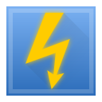
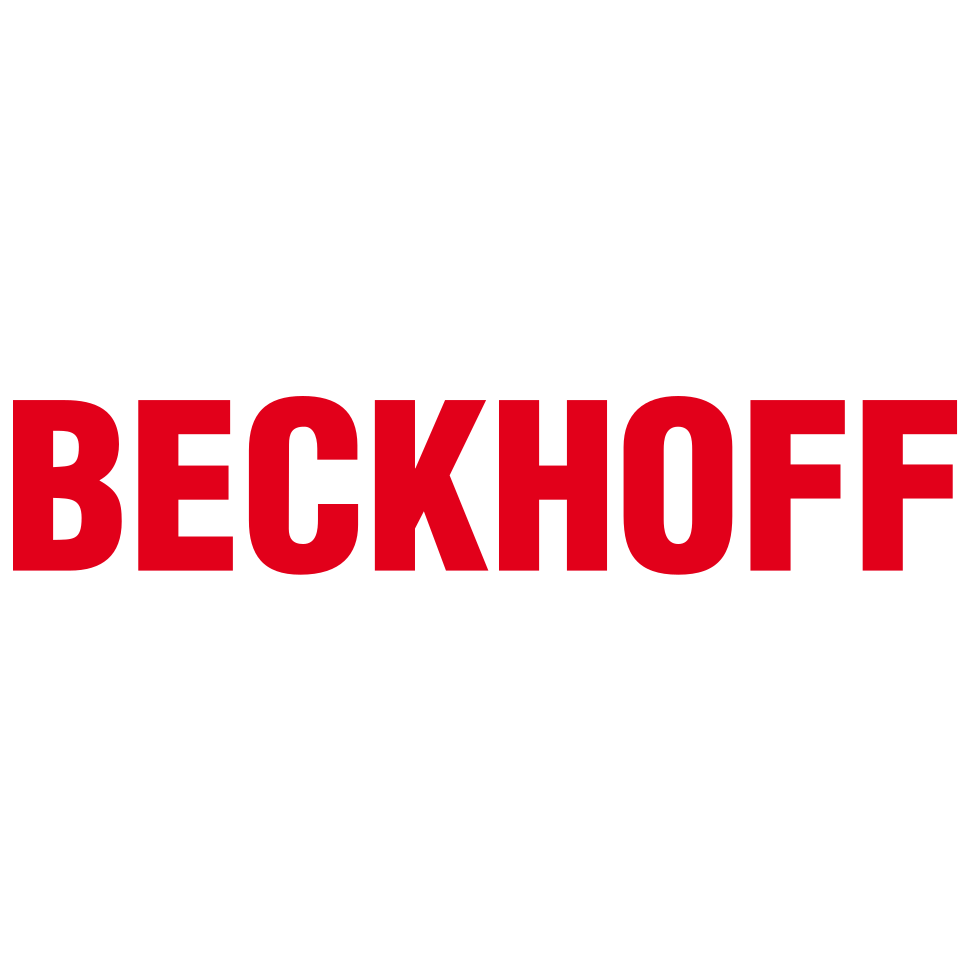
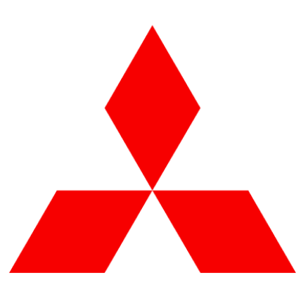
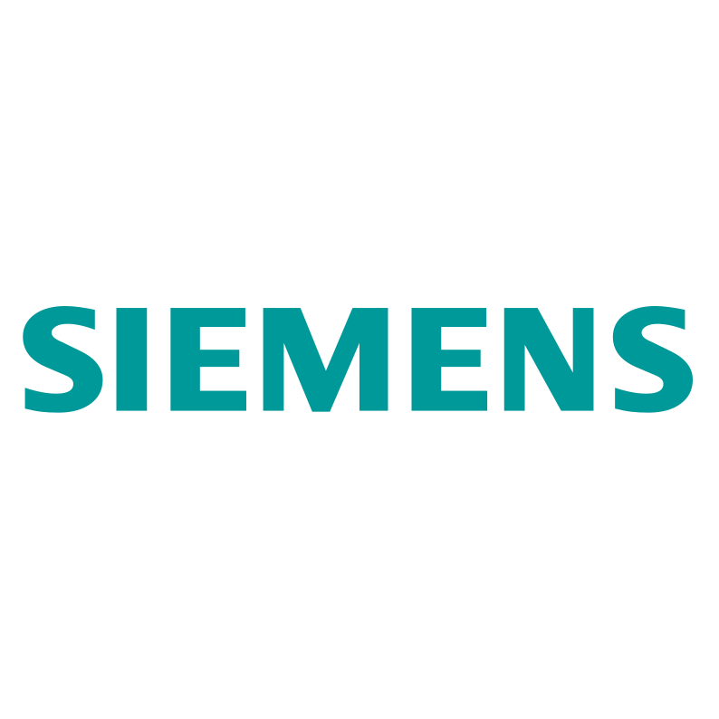
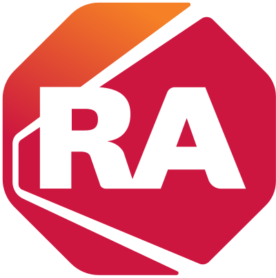

# Hello, I'm Artiom Duc 👋

Systems & Software Technician.

Industrial automation engineer (since 2017) and developer (since 2023). I build reliable, pragmatic solutions across PLC/robotics and modern web stacks.

🏠 [Website](https://arduc.ch) · 🧪 [Portfolio](https://arduc.ch/projects) · 💼 [LinkedIn](https://linkedin.com/in/artiom-duc)

## ✨ Highlights

- 🤖 Industrial automation: PLC programming, robotics, electromechanical design
- 🌐 Web apps: Vue 3 / Nuxt 4 / TypeScript / Tailwind CSS
- ⚙️ Backend: Node.js, Python
- 🧱 Infrastructure: Docker, Debian, NGINX/Caddy, pm2

## 💼 Client web projects

- 🪚 Menuiserie Roux: https://menuiserie-roux.ch
- 🧘 EM-MOTION: https://em-motion.ch

## 🧩 Open-source projects

### 🪖 Swiss Army Presence Controller

- 💻 Repo: https://github.com/ArtyomInc/pc.army.arduc.ch
- 🚀 Live: https://pc.army.arduc.ch

### 🪖 Swiss Army Guard Plan

- 💻 Repo: https://github.com/ArtyomInc/gp.army.arduc.ch
- 🚀 Live: https://gp.army.arduc.ch

## 🌐 Other published apps

- 🗒️ WorkMemo: https://workmemo.arduc.ch
- ⌨️ Terminal: https://term.arduc.ch
- ⏱️ Timer: https://timer.arduc.ch

## 🛠️ Tech stack

  
  
  
  
  
  
  
  
  
  
  
  
  
  
  
  
  
  
  
  
  
  
  
  
  
  
  
  
  
  
  
  

